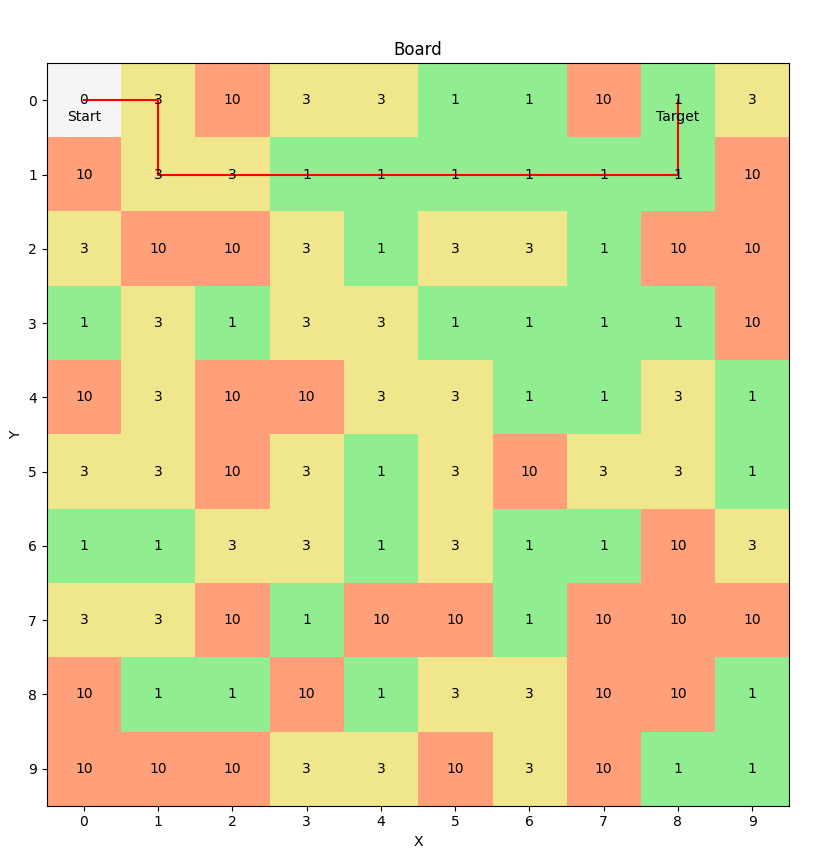

# Dijkstra Algorithm.

Dijkstra algorithm implementation for a 2d-array (matrix).

# How to use it
1. Clone repository. `git clone https://github.com/oleg-the-dev/dijkstra`
2. Install requirements `pip install -r requirements.txt`
3. Run `main.py` file

# Specifics
- By default `generate_random_data` function creates 10x10 matrix, you can change it by changing function's arguments or function call in `main.py`. 